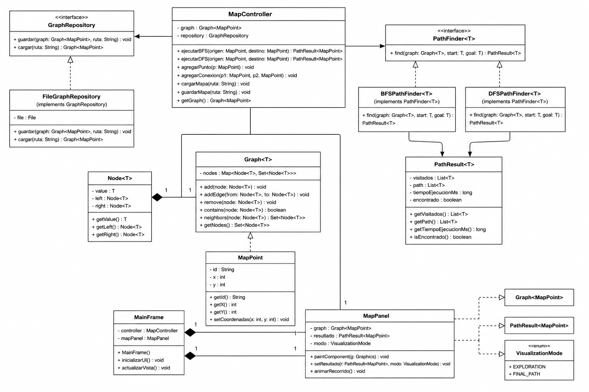

**[UNIVERSIDAD POLITECNICA SALESIANA]**
**[ESTRUCTURA DE DATOS]**

### Integrantes

| Nombre | Correo institucional |
|---|---|
| Nicolas Aguilar | [gaguilaru@est.ups.edu.ec] |
| Carlos Tello | [ctellob@est.ups.edu.ec] |
| Ricardo Uzhca | [ruzhcab@est.ups.edu.ec] |

## Indice:

1. Aplicación de los algoritmos BFS y DFS en un mapa
2. Integrantes
3. Introducción
4. Objetivo general
5. Objetivos específicos
6. Tecnologías utilizadas
7. Arquitectura y estructura de carpetas
8. Descripción del problema
9. Descripción general del programa
10. Clase MapPoint
11. Clase Graph
12. Persistencia: GraphRepository y FileGraphRepository
13. Parte de BFS, DFS, Controller, VisualizationMode y Recorrido final

    13.1. Interfaz PathFinder

    13.2. Clase PathResult

    13.3. Implementación de BFS

    13.4. Reconstrucción de la ruta en BFS

    13.5. Implementación de DFS

    13.6. Diferencia entre BFS y DFS

    13.7. MapController

    13.8. VisualizationMode

14. Parte de interfaz gráfica, visualización y edición del mapa
    
    14.1. Clase MapPanel

    14.2. Dibujo de nodos y conexiones

    14.3. Animación de la exploración y de la ruta

    14.4. Clase MainFrame

    14.5. Controles agrupados en tarjetas

    14.6. Selectores con nombre legible

    14.7. Registro de actividad
15. UML
16. Capturas de configuraciones del mapa
17. Resultados obtenidos y análisis
18. Conclusión
19. Recomendaciones y aplicaciones futuras

## Introducción

El proyecto consiste en una aplicación desarrollada en Java que representa diferentes lugares de un mapa mediante un grafo. Cada lugar corresponde a un nodo y las conexiones entre lugares se representan mediante aristas.

El usuario puede seleccionar un punto de inicio y un punto de destino y ejecutar una búsqueda utilizando BFS o DFS. El programa muestra los nodos que fueron visitados, la ruta encontrada, la cantidad de conexiones recorridas y el tiempo utilizado por el algoritmo.

También se pueden agregar o eliminar puntos, crear conexiones unidireccionales o bidireccionales y guardar la configuración del mapa en un archivo de texto.

Para desarrollar el proyecto se aplicaron temas vistos durante el ciclo, como grafos, clases genéricas, colas, conjuntos, mapas, recursividad, lectura de archivos, programación orientada a objetos e interfaces gráficas con Swing.

## Descripción del problema

Encontrar el camino entre dos ubicaciones dentro de un mapa es un problema común en aplicaciones de navegación, logística y videojuegos. El reto no es solo encontrar *una* ruta válida, sino poder comparar distintas estrategias de búsqueda (en este caso, en anchura y en profundidad) sobre la misma estructura de datos, y poder visualizar cómo cada una explora el grafo de forma distinta antes de llegar al destino.

Este proyecto resuelve ese problema modelando el mapa como un grafo genérico (`Graph<MapPoint>`), donde cada punto de interés es un nodo y cada calle o conexión entre dos puntos es una arista, que puede ser de un solo sentido o de doble sentido. Sobre esa estructura se implementan BFS y DFS, y se muestra en una interfaz gráfica tanto el proceso de exploración como el resultado final.

## Objetivo general

Desarrollar una aplicación en Java que permita representar un mapa mediante un grafo y buscar rutas entre dos puntos utilizando los algoritmos BFS y DFS.

## Objetivos específicos

- Representar lugares del mapa mediante nodos.
- Crear conexiones unidireccionales y bidireccionales.
- Implementar los algoritmos BFS y DFS.
- Mostrar los nodos visitados durante cada recorrido.
- Obtener la ruta encontrada desde el inicio hasta el destino.
- Medir el tiempo de ejecución de cada algoritmo.
- Guardar y cargar la información del grafo.
- Mostrar los resultados en una interfaz gráfica.

## Tecnologías utilizadas

- **Lenguaje:** Java (JDK 21).
- **Interfaz gráfica:** Swing (`JFrame`, `JPanel`, `Graphics2D`, `javax.swing.Timer` para las animaciones).
- **Estructuras de datos propias:** `Graph<T>`, `Node<T>`, `LinkedHashMap`, `LinkedHashSet` (para conservar el orden de inserción y de recorrido).
- **Persistencia:** lectura y escritura de archivos de texto plano (`BufferedReader`/`BufferedWriter`), sin librerías externas ni bases de datos.
- **Control de versiones:** Git y GitHub, con ramas individuales por integrante (`feature/model-persistence`, `feature/algorithms-controller`, `feature/gui-visualization`) integradas en `develop` y luego en `main`.
- **Entorno de desarrollo:** Visual Studio Code con el extension pack de Java.

## Arquitectura y estructura de carpetas

El proyecto sigue una arquitectura MVC (Modelo - Vista - Controlador), separando responsabilidades en paquetes:

```text
src/
├── App.java                          # Punto de entrada
├── models/
│   ├── MapPoint.java                 # Modelo: un punto del mapa
│   └── VisualizationMode.java        # Modelo: modo de visualización
├── structures/
│   ├── node/
│   │   └── Node.java                 # Nodo interno del grafo
│   └── graphs/
│       ├── Graph.java                # Estructura de grafo genérica
│       ├── PathFinder.java           # Interfaz común para BFS y DFS
│       ├── PathResult.java           # Resultado de una búsqueda
│       └── implementations/
│           ├── BFSPathFinder.java
│           └── DFSPathFinder.java
├── persistence/
│   ├── GraphRepository.java          # Contrato de guardado/carga
│   └── FileGraphRepository.java      # Implementación en texto plano
├── controllers/
│   └── MapController.java            # Conecta vista, grafo y algoritmos
├── views/
│   ├── MainFrame.java                # Ventana principal
│   └── MapPanel.java                 # Dibujo del mapa, nodos y animaciones
└── resources/
    ├── maps/                         # Imagen de fondo (captura de Google Maps)
    └── configuration/                # Archivo de configuración del grafo
```

Esta separación permite que, por ejemplo, `BFSPathFinder` y `DFSPathFinder` no sepan nada de Swing, y que `MapPanel` no sepa nada de cómo se recorre el grafo: solo recibe un `PathResult` ya calculado y lo dibuja.

## Descripción general del programa

La ejecución empieza en la clase `App`. En esta clase se intenta cargar el grafo desde el archivo de configuración.

## Clase MapPoint

La clase `MapPoint` representa un lugar del mapa. Guarda un identificador y dos coordenadas.

```java
private String id;
private int x;
private int y;
```

El constructor valida que el identificador no esté vacío y que las coordenadas no sean negativas.

```java
public MapPoint(String id, int x, int y) {
    if (id == null || id.isBlank()) {
        throw new IllegalArgumentException("El id de un MapPoint no puede estar vacío.");
    }
    this.id = id;
    setCoordenadas(x, y);
}
```

Si alguno de estos datos es incorrecto, se lanza una excepción en lugar de crear un punto con información inválida.

Los métodos `equals` y `hashCode` se generaron usando únicamente el identificador.

```java
if (id == null) {
    if (other.id != null)
        return false;
} else if (!id.equals(other.id))
    return false;
```

Esto significa que dos `MapPoint` con el mismo id se consideran el mismo punto, sin importar si cambian sus coordenadas. Esta decisión es importante porque `Graph<T>` usa `equals`/`hashCode` para saber si un nodo ya existe.

## Clase Graph

La clase `Graph<T>` almacena los puntos y sus conexiones utilizando un mapa.

```java
Map<Node<T>, Set<Node<T>>> nodes;
```

Se utilizó `LinkedHashMap` y `LinkedHashSet` en vez de `HashMap`/`HashSet` porque el proyecto necesita conservar el orden en que se agregan los nodos y las conexiones. Este orden se usa después para representar la exploración de BFS y DFS en la interfaz.

Agregar un nodo devuelve `true` o `false` según si ya existía.

```java
public boolean add(T value) {
    Node<T> nodo = new Node<>(value);
    if (nodes.containsKey(nodo)) {
        return false;
    }
    nodes.put(nodo, new LinkedHashSet<>());
    return true;
}
```

Las conexiones se crean con `addEdge` (bidireccional) y `addEdgeUni` (dirigida). Ninguna de las dos crea nodos automáticamente: si alguno de los dos puntos no existe en el grafo, la operación simplemente devuelve `false`.

```java
public boolean addEdge(T v1, T v2) {
    Node<T> nV1 = new Node<>(v1);
    Node<T> nV2 = new Node<>(v2);
    if (!nodes.containsKey(nV1) || !nodes.containsKey(nV2)) return false;
    boolean a = nodes.get(nV1).add(nV2);
    boolean b = nodes.get(nV2).add(nV1);
    return a || b;
}
```

Para eliminar existen `removeEdge`, `removeEdgeUni` y `removeNode`, que primero comprueban que los nodos existan antes de modificar la estructura.

```java
public void removeNode(T value) {
    Node<T> nodo = new Node<>(value);
    if (nodes.containsKey(nodo)) {
        nodes.remove(nodo);
        for (Set<Node<T>> set : nodes.values()) {
            set.remove(nodo);
        }
    }
}
```

`removeNode` no solo quita el nodo del mapa, también recorre el resto de conexiones para eliminar las referencias que otros nodos tenían hacia él.

El método `getVecinos` no devuelve la estructura interna del grafo, sino una copia. Esto evita que otra clase modifique el grafo directamente desde afuera.

```java
public Set<T> getVecinos(T current) {
    Node<T> nodo = new Node<>(current);
    Set<Node<T>> internos = nodes.getOrDefault(nodo, new LinkedHashSet<>());
    Set<T> vecinos = new LinkedHashSet<>();
    for (Node<T> n : internos) {
        vecinos.add(n.getValue());
    }
    return Collections.unmodifiableSet(vecinos);
}
```

También se agregaron `getNodes()`, que entrega la lista de puntos en orden de inserción, y `getGraph()`, que entrega una copia completa del grafo (nodo y sus vecinos). Estos dos métodos los usa la vista para dibujar los puntos y las conexiones sobre el mapa, y `FileGraphRepository` para recorrer el grafo al momento de guardarlo.

Por último, `getDirections()` y `getConnections()` cuentan cuántas conexiones dirigidas y bidireccionales tiene el grafo, recorriendo la estructura real en el momento en que se llaman, en vez de mantener un contador aparte que se pudiera desactualizar.

## Persistencia: GraphRepository y FileGraphRepository

`GraphRepository` es la interfaz que define el contrato de guardado y carga.

```java
public interface GraphRepository {
    void guardar(Graph<MapPoint> grafo, String rutaArchivo) throws IOException;
    Graph<MapPoint> cargar(String rutaArchivo) throws IOException;
}
```

`FileGraphRepository` es la implementación que guarda el grafo en un archivo de texto plano, sin usar librerías externas. El archivo se organiza en dos secciones: `NODOS` y `ARISTAS`.

```text
NODOS
A,100,120
B,250,130
ARISTAS
A,B,true
```

Cada nodo se guarda como `id,x,y` y cada conexión como `desde,hasta,esBidireccional`.

```java
List<MapPoint> nodos = grafo.getNodes();
for (MapPoint punto : nodos) {
    writer.write(punto.getId() + "," + punto.getX() + "," + punto.getY());
    writer.newLine();
}
```

Para saber si una conexión es bidireccional, se comprueba si el destino también tiene al origen como vecino.

```java
boolean bidireccional = grafo.getVecinos(destino).contains(origen);
```

Al cargar, se lee el archivo línea por línea. Una variable `seccion` indica si las líneas que siguen corresponden a nodos o a aristas.

```java
if (linea.equals("NODOS") || linea.equals("ARISTAS")) {
    seccion = linea;
    continue;
}
```

Cada línea se separa con `split(",")` para reconstruir el `MapPoint` o la conexión correspondiente. Los puntos se guardan primero en un mapa temporal (`puntosPorId`) para poder relacionar las aristas con el objeto `MapPoint` correcto antes de agregarlas al grafo.

```java
MapPoint desde = puntosPorId.get(partes[0]);
MapPoint hasta = puntosPorId.get(partes[1]);
```

## Parte de BFS, DFS, Controller, VisualizationMode y Recorrido final

En esta parte esta encargada principalmente del funcionamiento de los recorridos BFS y DFS, de la información generada por cada búsqueda y del controlador utilizado para conectar los algoritmos con la interfaz.

Los archivos trabajados fueron:

- PathFinder.java
- PathResult.java
- BFSPathFinder.java
- DFSPathFinder.java
- MapController.java
- VisualizationMode.java

También se realizaron pruebas utilizando objetos "MapPoint" para verificar que los algoritmos funcionaran con el mismo tipo de dato utilizado por el programa.

## Interfaz PathFinder

Se creó la interfaz `PathFinder<T>` para definir la estructura común que deben cumplir los algoritmos de búsqueda.

```java
public interface PathFinder<T> {

    PathResult<T> find(Graph<T> graph, T start, T end);
}
```

El método "find" recibe tres datos:

- El grafo donde se realizará la búsqueda.
- El nodo de inicio.
- El nodo de destino.

Como resultado devuelve un objeto `PathResult<T>`.

BFS y DFS implementan esta interfaz, por lo que los dos algoritmos pueden utilizarse de una forma parecida.

```java
PathFinder<MapPoint> bfs = new BFSPathFinder<>();
PathFinder<MapPoint> dfs = new DFSPathFinder<>();
```


## Clase PathResult

La clase `PathResult<T>` almacena la información generada después de ejecutar BFS o DFS.

Sus atributos principales son:

```java
private final Set<T> visitados;
private final Set<T> path;
private final long tiempoEjecucion;
private final boolean encontrado;
```

El conjunto "visitados" contiene todos los nodos que el algoritmo revisó durante la búsqueda.

El conjunto "path" contiene solamente los nodos que forman parte de la ruta final.


El atributo "tiempoEjecucion" guarda el tiempo utilizado por el algoritmo. Para medirlo se registra el tiempo antes de comenzar:

```java
long inicioTiempo = System.nanoTime();
```

Después se resta el tiempo inicial al tiempo final:

```java
System.nanoTime() - inicioTiempo
```

El resultado se guarda en nanosegundos.

El atributo "encontrado" indica si existe o no una ruta entre los dos puntos seleccionados.

```java
private final boolean encontrado;
```

Cuando se encuentra el destino, su valor es `true`. Cuando los puntos no están conectados o alguno de ellos no existe, su valor es `false`.

También se implementó un método para conocer la cantidad de nodos visitados:

```java
public int getCantidadVisitados() {
    return visitados.size();
}
```

La cantidad de aristas se calcula utilizando la cantidad de nodos que forman la ruta.

```java
public int getCantidadAristas() {
    if (!encontrado || path.isEmpty()) {
        return 0;
    }

    return path.size() - 1;
}
```

Por ejemplo, la ruta formada por los nodos `A`, `B` y `C` contiene dos aristas: una conexión entre A y B y otra entre B y C.

## Implementación de BFS

BFS significa búsqueda en anchura. Este algoritmo primero revisa los vecinos directos del nodo inicial y después continúa con los vecinos de esos nodos.

La clase se declaró de la siguiente forma:

```java
public class BFSPathFinder<T> implements PathFinder<T>
```

Al implementar `PathFinder<T>`, la clase debe contener el método find.

```java
public PathResult<T> find(Graph<T> graph, T start, T end)
```

Al comenzar el método se registra el tiempo inicial:

```java
long inicioTiempo = System.nanoTime();
```

Después se crean las estructuras necesarias para realizar la búsqueda.

```java
Queue<T> queue = new LinkedList<>();
Set<T> visitados = new LinkedHashSet<>();
Map<T, T> parent = new LinkedHashMap<>();
```

La cola "queue" se utiliza para controlar el orden de los nodos pendientes. BFS trabaja con el principio de que el primer elemento que entra es el primero que sale.

El conjunto "visitados" evita que un nodo sea revisado más de una vez. Esto también evita recorridos infinitos cuando el grafo contiene ciclos.

Se utilizó "LinkedHashSet" porque, además de evitar elementos repetidos, mantiene el orden en que los nodos fueron agregados. Este orden se necesita después para mostrar la exploración en la interfaz.

El mapa "parent" guarda el nodo desde el cual se llegó a cada vecino.

Por ejemplo, si se recorre A, después B y luego C, se puede almacenar lo siguiente:

```text
A tiene como padre null
B tiene como padre A
C tiene como padre B
```

Antes de empezar el recorrido se validan los datos recibidos.

```java
if (graph == null || start == null || end == null || !graph.contains(start) || !graph.contains(end)) {
    return new PathResult<>(visitados, new LinkedHashSet<>(), System.nanoTime() - inicioTiempo, false);
}
```

Esta validación comprueba que el grafo no sea nulo, que el inicio y el destino sean válidos y que los dos puntos existan dentro del grafo.

Si alguno de estos datos es incorrecto, se devuelve un resultado vacío sin ejecutar el recorrido.

Luego se agrega el nodo inicial a la cola, al conjunto de visitados y al mapa de padres.

```java
queue.add(start);
visitados.add(start);
parent.put(start, null);
```

El recorrido se mantiene mientras existan elementos dentro de la cola.

```java
while (!queue.isEmpty()) {
    T current = queue.poll();
}
```

"queue.poll()" obtiene y elimina el primer elemento de la cola.

Después se compara el nodo actual con el destino.

```java
if (current.equals(end)) {
    return new PathResult<>(visitados, buildPath(parent, end), System.nanoTime() - inicioTiempo, true);
}
```

Si el nodo actual es el destino, se reconstruye la ruta y se devuelve el resultado.

Cuando todavía no se llega al destino, se obtienen los vecinos del nodo actual.

```java
for (T vecino : graph.getVecinos(current)) {
    if (!visitados.contains(vecino)) {
        visitados.add(vecino);
        parent.put(vecino, current);
        queue.add(vecino);
    }
}
```

Cada vecino que todavía no ha sido visitado se registra, se relaciona con su nodo padre y se agrega al final de la cola.

Si la cola queda vacía y nunca se encuentra el destino, el método devuelve un resultado con "encontrado" en "false".

## Reconstrucción de la ruta en BFS

BFS no construye directamente la ruta mientras realiza la exploración. Para obtenerla utiliza el mapa "parent".

La reconstrucción empieza desde el destino y retrocede hasta llegar al nodo inicial.

```java
for (T at = end; at != null; at = parent.get(at)) {
    pathInvertido.add(at);
}
```

Si la ruta correcta es:

```text
A, E, D
```

el ciclo la obtiene inicialmente de la siguiente forma:

```text
D, E, A
```

Por esta razón se debe invertir la lista.

```java
Collections.reverse(pathInvertido);
```

Finalmente se convierte en un "LinkedHashSet" para conservar el orden.

```java
return new LinkedHashSet<>(pathInvertido);
```

Una característica importante de BFS es que encuentra la ruta con menor cantidad de aristas cuando el grafo no utiliza pesos.

## Implementación de DFS

DFS significa búsqueda en profundidad. A diferencia de BFS, DFS sigue una rama del grafo hasta donde sea posible antes de regresar y probar otra.

La clase también implementa la interfaz `PathFinder<T>`.

```java
public class DFSPathFinder<T> implements PathFinder<T>
```

Al iniciar se crean dos conjuntos.

```java
Set<T> visitados = new LinkedHashSet<>();
Set<T> path = new LinkedHashSet<>();
```

"visitados" guarda todos los nodos revisados por el algoritmo.

"path" guarda el camino que se está formando durante la búsqueda.

Antes de ejecutar la recursividad se comprueba que el grafo, el inicio y el destino sean válidos.

```java
if (graph == null || start == null || end == null || !graph.contains(start) || !graph.contains(end)) {
    return new PathResult<>(visitados, path, System.nanoTime() - inicioTiempo, false);
}
```

Después se llama al método recursivo.

```java
boolean encontrado = dfs(graph, start, end, visitados, path);
```

El método "dfs" recibe el nodo actual, el destino, los visitados y el camino.

```java
private boolean dfs(Graph<T> graph, T current, T end, Set<T> visitados, Set<T> path)
```

Primero se registra el nodo actual.

```java
visitados.add(current);
path.add(current);
```

Luego se comprueba si el nodo actual es el destino.

```java
if (current.equals(end)) {
    return true;
}
```

Si todavía no se llegó al destino, se recorren los vecinos del nodo actual.

```java
for (T vecino : graph.getVecinos(current)) {
    if (!visitados.contains(vecino)) {
        if (dfs(graph, vecino, end, visitados, path)) {
            return true;
        }
    }
}
```

Por cada vecino no visitado se realiza una nueva llamada al mismo método. Esto permite que DFS avance cada vez más dentro de una rama.

Si una rama no lleva al destino, se elimina el nodo actual del camino.

```java
path.remove(current);
return false;
```

Esta parte corresponde al retroceso o backtracking.

El nodo se elimina de "path" porque no forma parte de la ruta final, pero permanece dentro de "visitados" porque ya fue revisado.

Por ejemplo, si el algoritmo intenta recorrer A, B y C, pero desde C no puede llegar al destino, C se elimina de la ruta y la ejecución regresa a B para revisar otro vecino.

DFS permite encontrar una ruta si existe, pero no garantiza que sea la más corta.

## Diferencia entre BFS y DFS

Para comprobar los algoritmos se utilizó un grafo formado por los puntos A, B, C, D y E.

Las conexiones permitían llegar desde A hasta D de dos formas:

```text
A, B, C, D
```

o:

```text
A, E, D
```

BFS encontró:

```text
A, E, D
```

Esto ocurre porque BFS revisa primero los puntos que se encuentran a menor cantidad de conexiones desde el inicio.

DFS encontró:

```text
A, B, C, D
```

Esto ocurre porque DFS sigue primero una rama completa según el orden en que aparecen los vecinos.

Los dos algoritmos encontraron una ruta correcta, pero BFS encontró la que tenía menos conexiones.

## MapController

La clase `MapController` se encarga de comunicar la interfaz con el grafo, los algoritmos y la persistencia.

Sus atributos son:

```java
private Graph<MapPoint> graph;
private GraphRepository repository;
```

El controlador recibe estos objetos en su constructor.

```java
public MapController(Graph<MapPoint> graph, GraphRepository repository) {
    this.graph = graph;
    this.repository = repository;
}
```

Para ejecutar BFS se creó el siguiente método:

```java
public PathResult<MapPoint> ejecutarBFS(MapPoint inicio, MapPoint destino) {
    PathFinder<MapPoint> bfs = new BFSPathFinder<>();
    return bfs.find(graph, inicio, destino);
}
```

Este método crea un objeto "BFSPathFinder" y ejecuta "find" utilizando el grafo actual.

Para ejecutar DFS se utiliza el mismo procedimiento.

```java
public PathResult<MapPoint> ejecutarDFS(MapPoint inicio, MapPoint destino) {
    PathFinder<MapPoint> dfs = new DFSPathFinder<>();
    return dfs.find(graph, inicio, destino);
}
```

También se creó un método general que recibe el nombre del algoritmo.

```java
public PathResult<MapPoint> ejecutar(String algoritmo, MapPoint inicio, MapPoint destino)
```

Dentro del método se comprueba la opción seleccionada.

```java
if (algoritmo.equalsIgnoreCase("BFS")) {
    return ejecutarBFS(inicio, destino);
}

if (algoritmo.equalsIgnoreCase("DFS")) {
    return ejecutarDFS(inicio, destino);
}
```

La interfaz solamente debe enviar el nombre del algoritmo, el inicio y el destino. El controlador se encarga de decidir qué clase debe utilizar.

Además de ejecutar los algoritmos, el controlador contiene operaciones para agregar y eliminar puntos.

```java
public boolean agregarPunto(MapPoint punto) {
    if (punto == null) {
        return false;
    }

    return graph.add(punto);
}
```

También administra las conexiones.

```java
public boolean agregarConexion(MapPoint inicio, MapPoint destino, boolean bidireccional) {
    if (inicio == null || destino == null) {
        return false;
    }

    if (bidireccional) {
        return graph.addEdge(inicio, destino);
    }

    return graph.addEdgeUni(inicio, destino);
}
```

Cuando la conexión es bidireccional se utiliza "addEdge". Cuando es unidireccional se utiliza "addEdgeUni".

El controlador también permite eliminar conexiones y solicitar el guardado o la carga de información.

```java
public void guardar(String rutaArchivo) throws IOException {
    repository.guardar(graph, rutaArchivo);
}
```

```java
public void cargar(String rutaArchivo) throws IOException {
    graph = repository.cargar(rutaArchivo);
}
```

Con esta organización, la interfaz no necesita acceder directamente a las operaciones internas del grafo ni conocer cómo se guarda el archivo.

## VisualizationMode

Se creó la enumeración `VisualizationMode` para indicar cómo debe mostrarse el resultado.

```java
public enum VisualizationMode {
    EXPLORATION,
    FINAL_PATH
}
```

En el modo `EXPLORATION` se muestran los nodos según el orden en que fueron visitados.

En el modo `FINAL_PATH` se muestra únicamente el camino final desde el inicio hasta el destino.

Esta clase no ejecuta BFS ni DFS. Su función es informar a la interfaz qué parte del `PathResult` debe representar.


## Parte de interfaz gráfica, visualización y edición del mapa

Esta parte estuvo encargada de la interfaz gráfica, es decir, de todo lo que el usuario ve y con lo que interactúa: el mapa, los nodos, las conexiones, los controles y las animaciones.

Los archivos trabajados fueron:

- MainFrame.java
- MapPanel.java

Esta parte no contiene lógica de grafos ni de algoritmos. La interfaz solamente pide información al `MapController` y dibuja el resultado que este devuelve. Esto respeta el patrón MVC: la vista no ejecuta BFS ni DFS, y `Graph`, `BFSPathFinder` y `DFSPathFinder` no dibujan nada directamente.

## Clase MapPanel

`MapPanel` es un `JPanel` que se encarga únicamente de dibujar: la imagen de fondo, las conexiones, la ruta encontrada y los nodos.

```java
public class MapPanel extends JPanel {
    private Graph<MapPoint> grafo;
    private Image imagenFondo;
    ...
}
```

Todo el dibujo ocurre dentro de `paintComponent`, que es el método que Swing llama automáticamente cada vez que el panel necesita redibujarse.

```java
@Override
protected void paintComponent(Graphics g) {
    super.paintComponent(g);
    Graphics2D g2 = (Graphics2D) g;
    ...
    dibujarAristas(g2);
    dibujarPath(g2);
    dibujarNodos(g2);
}
```

Se dividió el dibujo en tres métodos separados (`dibujarAristas`, `dibujarPath`, `dibujarNodos`) para que cada uno tenga una sola responsabilidad y sea más fácil de leer.

## Dibujo de nodos y conexiones

Para dibujar las conexiones, `MapPanel` recorre el grafo mediante `getGraph()`, el método de consulta que expone `Graph<T>` sin permitir modificarlo desde afuera.

```java
Map<MapPoint, Set<MapPoint>> mapa = grafo.getGraph();

for (Map.Entry<MapPoint, Set<MapPoint>> entry : mapa.entrySet()) {
    MapPoint origen = entry.getKey();
    for (MapPoint destino : entry.getValue()) {
        boolean bidireccional = mapa.containsKey(destino) && mapa.get(destino).contains(origen);
        ...
    }
}
```

Una conexión se considera bidireccional cuando el nodo destino también tiene al origen como vecino. Cuando no es así, se dibuja una pequeña flecha en el extremo final de la línea, para que el usuario pueda distinguir a simple vista una calle de un solo sentido de una calle de doble sentido.

```java
private void dibujarFlecha(Graphics2D g2, MapPoint origen, MapPoint destino) {
    double angulo = Math.atan2(dy, dx);
    ...
    g2.fillPolygon(xs, ys, 3);
}
```

Cada nodo se dibuja como un círculo, usando las coordenadas `x` e `y` guardadas en `MapPoint`. El color del borde cambia según el estado del nodo: verde si es el inicio, rojo si es el destino, y azul si fue visitado durante la búsqueda.

```java
if (punto.equals(nodoInicio)) {
    borde = COLOR_INICIO;
    grosor = 3f;
}
if (punto.equals(nodoDestino)) {
    borde = COLOR_DESTINO;
    grosor = 3f;
}
```

## Animación de la exploración y de la ruta

`MapPanel` recibe el `PathResult` que entrega el `MapController` junto con el `VisualizationMode` elegido por el usuario, y decide cómo animarlo.

```java
public void mostrarResultado(PathResult<MapPoint> resultado, MapPoint inicio, MapPoint destino,
        VisualizationMode modo) {
    ...
    if (mostrarVisitadosProgresivo && !visitadosOrdenados.isEmpty()) {
        iniciarAnimacionVisitados();
    } else {
        iniciarAnimacionPath();
    }
}
```

Cuando el modo es `EXPLORATION`, primero se van revelando uno por uno los nodos visitados, en el mismo orden en que el algoritmo los recorrió (por eso era importante que `PathResult` usara `LinkedHashSet` y conservara el orden de inserción). Al terminar de revelar todos los visitados, se anima automáticamente la ruta final.

```java
private void iniciarAnimacionVisitados() {
    timerVisitados = new Timer(INTERVALO_VISITADOS_MS, ...);
    timerVisitados.start();
}
```

Cuando el modo es `FINAL_PATH`, se omite por completo la animación de los visitados y se dibuja directamente la ruta desde el inicio hasta el destino, sin mostrar los nodos intermedios que el algoritmo tuvo que explorar.

Ambas animaciones usan `javax.swing.Timer` en lugar de `Thread.sleep()`, porque `Thread.sleep()` dentro del hilo de Swing congelaría toda la ventana mientras dura la animación.

```java
timerPath = new Timer(INTERVALO_TIMER_MS, new java.awt.event.ActionListener() {
    @Override
    public void actionPerformed(java.awt.event.ActionEvent e) {
        progreso += INCREMENTO_POR_TICK;
        ...
        repaint();
    }
});
```

## Clase MainFrame

`MainFrame` es la ventana principal. Se encarga de organizar los controles y de comunicarlos con el `MapController`; no contiene lógica de dibujo, eso lo delega completamente a `MapPanel`.

La ventana se dividió en cuatro zonas usando `BorderLayout`:

```java
add(crearBarraSuperior(), BorderLayout.NORTH);
add(mapPanel, BorderLayout.CENTER);
add(crearBarraLateral(), BorderLayout.EAST);
add(crearPanelLog(), BorderLayout.SOUTH);
```

- **Barra superior:** título de la aplicación y un resumen rápido del último resultado (algoritmo usado, nodos visitados, cantidad de aristas y tiempo de ejecución).
- **Mapa:** el `MapPanel`, en el centro.
- **Barra lateral:** los controles, agrupados en tarjetas.
- **Panel inferior:** un registro de actividad.

## Controles agrupados en tarjetas

Para no amontonar todos los controles en una sola fila, se agruparon en cuatro tarjetas independientes, cada una con una responsabilidad clara: **Ruta**, **Nodos**, **Conexiones** y **Configuración**.

La tarjeta de **Ruta** permite elegir el nodo de inicio, el nodo de destino, el algoritmo (BFS o DFS) y el modo de visualización (Exploración o Ruta final):

```java
String algoritmo = radioBFS.isSelected() ? "BFS" : "DFS";
VisualizationMode modo = radioExploracion.isSelected()
        ? VisualizationMode.EXPLORATION
        : VisualizationMode.FINAL_PATH;

PathResult<MapPoint> resultado = controller.ejecutar(algoritmo, inicio, destino);
```

La tarjeta de **Nodos** permite crear un nodo nuevo directamente sobre la imagen del mapa. Al activar el botón "Crear nodo", el siguiente click sobre el mapa abre un cuadro de diálogo pidiendo el identificador, y con esa información se construye un nuevo `MapPoint` en las coordenadas exactas donde se hizo click.

```java
mapPanel.addMouseListener(new MouseAdapter() {
    @Override
    public void mousePressed(MouseEvent e) {
        if (modoCrearNodo) {
            crearNodoEnClick(e.getX(), e.getY());
        }
    }
});
```

```java
private void crearNodoEnClick(int x, int y) {
    String id = JOptionPane.showInputDialog(this, "Identificador del nuevo nodo:", "Crear nodo", ...);
    ...
    MapPoint nuevo = new MapPoint(id, x, y);
    boolean agregado = controller.agregarPunto(nuevo);
    ...
}
```

Esta misma tarjeta permite eliminar un nodo existente, seleccionándolo desde una lista desplegable.

La tarjeta de **Conexiones** permite crear una conexión entre dos nodos, eligiendo si es unidireccional o bidireccional mediante dos botones de opción, y también eliminarla:

```java
boolean bidireccional = radioBi.isSelected();
boolean agregada = controller.agregarConexion(origen, destino, bidireccional);
```

La tarjeta de **Configuración** permite guardar el estado actual del grafo en el archivo de configuración y volver a cargarlo, delegando directamente en el `MapController`:

```java
controller.guardar(RUTA_CONFIGURACION);
...
controller.cargar(RUTA_CONFIGURACION);
mapPanel.setGrafo(controller.getGraph());
```

Después de cargar, es necesario volver a pasarle el grafo a `MapPanel` con `setGrafo`, porque el controlador reemplaza internamente su referencia al grafo, y sin ese paso la vista seguiría mostrando el grafo anterior.

## Selectores con nombre legible

Los `JComboBox` que muestran nodos no usan el `toString()` por defecto de `MapPoint`, porque ese método está pensado para depuración y no para mostrarse al usuario. En su lugar, se configuró un `renderer` propio para cada combo, que muestra solamente el identificador y las coordenadas:

```java
combo.setRenderer(new DefaultListCellRenderer() {
    @Override
    public Component getListCellRendererComponent(JList<?> list, Object value, int index,
            boolean isSelected, boolean cellHasFocus) {
        JLabel label = (JLabel) super.getListCellRendererComponent(...);
        if (value instanceof MapPoint) {
            MapPoint punto = (MapPoint) value;
            label.setText(punto.getId() + "   (" + punto.getX() + ", " + punto.getY() + ")");
        }
        return label;
    }
});
```

## Registro de actividad

Como último elemento se agregó un panel de registro en la parte inferior de la ventana, con un `JTextArea` de solo lectura. Cada vez que ocurre una acción relevante (ejecutar un algoritmo, crear o eliminar un nodo, agregar o quitar una conexión, guardar o cargar la configuración) se agrega una línea nueva.

```java
private void agregarLog(String mensaje) {
    areaLog.append(mensaje + "\n");
    areaLog.setCaretPosition(areaLog.getDocument().getLength());
}
```

## UML



El diagrama muestra la separación por capas del proyecto: `MapPoint` y `VisualizationMode` como modelo, `Graph`/`Node`/`PathFinder`/`PathResult`/`BFSPathFinder`/`DFSPathFinder` como las estructuras de datos y algoritmos, `GraphRepository`/`FileGraphRepository` como la capa de persistencia, `MapController` como intermediario entre la vista y el resto del sistema, y `MainFrame`/`MapPanel` como la vista. Las flechas de dependencia van siempre desde las capas externas (vista) hacia las internas (modelo y algoritmos), nunca al revés: ni `Graph`, ni `BFSPathFinder`, ni `DFSPathFinder` conocen la existencia de Swing ni de ninguna clase de `views`.

## Capturas de configuraciones del mapa

A continuación se muestran dos configuraciones distintas del mapa, cada una con su propio conjunto de nodos y conexiones, para demostrar que la aplicación funciona con distintos grafos y no con datos fijos.

**Configuración 1:**


**Configuración 2:**


## Resultados obtenidos y análisis

Se debe registrar información obtenida mediante ejecuciones reales. Los tiempos, rutas, observaciones y evidencias no deben ser inventados.

### Tabla 1. Comparación de BFS y DFS

| Caso | Algoritmo | Inicio | Destino | Nodos visitados | Cantidad de aristas | Tiempo |
|---|---|---|---|---|---|---|
| 1 | BFS | A | B | 3 (A→B→D) | 1 | 1.09 ms |
| 1 | DFS | A | B | 2 (A→B) | 1 | 0.04 ms |
| 2 | BFS | A | G | 7 (A→B→D→C→E→G→F) | 3 | 0.07 ms |
| 2 | DFS | A | G | 7 (A→B→C→E→D→F→G) | 5 | 0.05 ms |
| 3 | BFS | A | H | 7 (sin llegar a H) | 0 (sin ruta) | 0.05 ms |
| 3 | DFS | A | H | 7 (sin llegar a H) | 0 (sin ruta) | 0.07 ms |

### Rutas encontradas

- **Caso 1 (A → B):** `A → B`. Ruta directa, ambos algoritmos coinciden.
- **Caso 2 BFS (A → G):** `A → B → C → G`. BFS encontró la ruta con menor cantidad de conexiones (3 aristas), porque explora primero los nodos más cercanos al origen.
- **Caso 2 DFS (A → G):** `A → B → C → E → F → G`. DFS encontró una ruta válida pero más larga (5 aristas), porque avanza en profundidad por una rama antes de retroceder.
- **Caso 3 (A → H):** ninguno de los dos algoritmos encontró ruta, porque H no tiene ninguna conexión con el resto del grafo. Ambos exploraron correctamente los 7 nodos alcanzables antes de terminar sin éxito.

### Análisis

Los resultados confirman el comportamiento teórico esperado de cada algoritmo:

- **BFS** garantiza la ruta con menor número de conexiones (el equivalente al camino más corto en un grafo sin pesos), a costa de visitar los nodos "por niveles" alrededor del origen.
- **DFS** no garantiza la ruta más corta, pero suele llegar al destino visitando la misma cantidad de nodos totales; la diferencia está en el orden y en la longitud de la ruta final, no necesariamente en el tiempo de ejecución.
- El tiempo de ejecución de ambos algoritmos es del orden de fracciones de milisegundo para grafos pequeños como el de prueba (8 nodos), por lo que la diferencia de rendimiento entre BFS y DFS solo sería perceptible con grafos mucho más grandes.
- El caso sin ruta (Caso 3) demuestra que ambos algoritmos terminan correctamente sin quedarse en un ciclo infinito ni lanzar excepciones cuando el destino es inalcanzable.

## Conclusión

Conclucion integrante 1: El comportamiento de BFS y DFS depende directamente de las decisiones tomadas en el grafo. Cambiar HashMap y HashSet por LinkedHashMap y LinkedHashSet en Graph<T> fue lo que permitió que ambos algoritmos recorrieran los vecinos de cada nodo siempre en el mismo orden en que fueron agregados; sin ese cambio, el orden de exploración habría sido distinto en cada ejecución.

También se comprobó que la persistencia debe reconstruir el grafo con exactamente las mismas conexiones y el mismo orden con que fue guardado. En las pruebas, al guardar y volver a cargar la misma configuración, BFS y DFS encontraron las mismas rutas y visitaron los mismos nodos que antes de guardar, lo que confirmó que el grafo se reconstruye de forma correcta.

Conclucion integrante 2: Implementar BFS y DFS sobre el mismo grafo permitió comprobar en la práctica las diferencias reales entre ambos algoritmos. BFS siempre encontró la ruta con menor cantidad de conexiones, porque explora primero los nodos más cercanos al inicio, mientras que DFS avanzó por una rama completa antes de retroceder, lo que en varios casos generó una ruta más larga aunque igualmente válida.

Corregir la reconstrucción de la ruta en BFS, usando el mapa de predecesores, y aplicar el retroceso en DFS (eliminando un nodo de path cuando una rama no llega al destino, pero manteniéndolo en visitados) ayudó a entender por qué cada algoritmo necesita una estrategia distinta para reconstruir su camino final.

Conclucion integrante 3: Ver BFS y DFS funcionando en la interfaz ayudó a entender mejor la diferencia real entre ambos algoritmos. En el modo exploración, BFS revela los nodos "en anillos" alrededor del inicio, marcando primero todos los vecinos directos, mientras que DFS avanza en una sola línea hacia adelante y solo retrocede cuando una rama ya no tiene más vecinos por visitar.

En el modo ruta final se confirmó lo mismo que muestran los resultados: para los mismos nodos, BFS entregó consistentemente la ruta con menos conexiones, mientras que DFS en varios casos encontró una ruta más larga. Que PathResult conservara el orden real de visita fue lo que permitió mostrar esta diferencia de forma visual y no solo como un dato en la barra de estado.

## Recomendaciones y aplicaciones futuras

**Recomendaciones para continuar el proyecto:**

- Corregir la unidad de tiempo reportada en `PathResult`: actualmente `System.nanoTime()` se guarda sin convertir a milisegundos, por lo que el valor mostrado en la interfaz debería dividirse entre `1_000_000` antes de mostrarse como "ms".
- Agregar una opción para exportar la configuración del grafo en formato JSON, además del texto plano actual, para facilitar la integración con otras herramientas.
- Agregar pruebas unitarias automatizadas (por ejemplo con JUnit) para `Graph`, `BFSPathFinder` y `DFSPathFinder`, en lugar de depender únicamente de pruebas manuales desde consola o desde la interfaz.
- Permitir editar las coordenadas de un nodo existente sin tener que eliminarlo y volver a crearlo.

**Posibles aplicaciones futuras:**

- Adaptar el proyecto para calcular rutas en un mapa real con pesos en las aristas (distancia, tiempo o tráfico), incorporando algoritmos como Dijkstra o A*, reutilizando la misma interfaz `PathFinder<T>`.
- Usarlo como base para un sistema de navegación interno de un campus universitario o de un edificio, donde cada `MapPoint` represente una habitación o pasillo.
- Extender el modelo para representar redes de transporte público, usando aristas dirigidas para representar rutas de buses de un solo sentido.
- Reutilizar `Graph<T>` como estructura genérica para otros problemas de la materia (por ejemplo, redes sociales o dependencias entre tareas), ya que no depende de `MapPoint` en ningún momento.